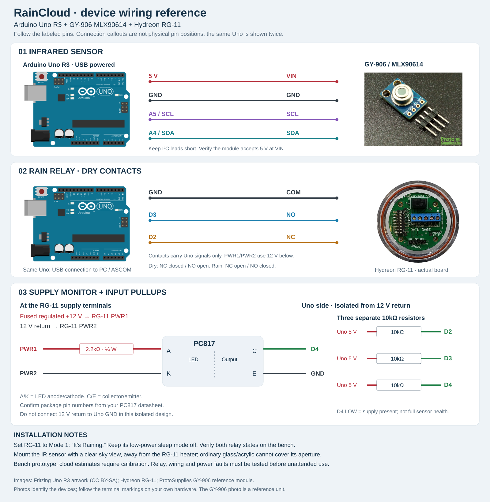

# Hardware design

## Wiring diagram

[Editable SVG](images/raincloud-wiring.svg) · [PNG image](images/raincloud-wiring.png). Device images and separate, noncrossing connection callouts show the infrared sensor, rain relay and isolated supply monitor. Follow the labeled pin names, not their positions on the sheet. The same Uno is shown twice for clarity. The GY-906 photograph shows a reference module; verify your own module's markings.

### Editable Fritzing project

[Download raincloud-wiring.fzz](raincloud-wiring.fzz) · [Fritzing layout preview](images/raincloud-fritzing-layout.png)

Open the `.fzz` in Fritzing and select **Breadboard** for embedded device images and color-coded, editable right-angle wires. **Schematic** contains the same connections using labeled blocks. The project includes its custom parts; no separate part download is needed. It uses one Uno representation, with the pullups at left, sensors at right, and the isolated supply circuit below. Connector callouts identify pin names; they are not the devices' physical pin positions. Crossings without joined endpoints are not electrical junctions. There is no PCB fabrication layout.

Both views were successfully exported by the installed Fritzing application and visually inspected. Automated checks confirm that all 21 original connections are preserved, without merging unrelated nets. This verifies the drawing, not operation of the hardware.

Device image sources: [Fritzing Uno artwork](https://github.com/fritzing/fritzing-parts) (CC BY-SA), [Hydreon RG-11 board photograph](https://rainsensors.com/products/rg-11/), and [ProtoSupplies GY-906 photograph](https://protosupplies.com/product/gy-906-mlx90614-non-contact-precision-thermometer-module/). Photographs retain their original appearance and attribution; no ownership or endorsement is implied.

## Parts
Uno R3, USB cable, GY-906, RG-11, regulated 12 V sensor supply with a fused branch, PC817 optocoupler, 2.2k ohm 1/4 W LED resistor, three 10k pullups, outdoor cable, terminal blocks, sealed enclosure and cable glands. The power monitor below is designed for regulated **12 V**, not the full RG-11 input range. Uno remains USB powered.

## Connections
| Connection | Destination |
|---|---|
| GY-906 VIN | Uno 5 V, per the supplied module listing; verify module markings |
| GY-906 GND | Uno GND |
| GY-906 SDA / SCL | Uno A4 / A5 |
| RG-11 PWR1 / PWR2 | Fused +12 V / supply return; confirm terminal markings |
| RG-11 relay COM | Uno GND |
| RG-11 relay NC | Uno D2 |
| RG-11 relay NO | Uno D3 |
| D2, D3, D4 | Each pulled up to Uno 5 V through a separate 10k resistor |

Do not connect sensor 12 V to any Uno input. The dry relay contacts carry only the Uno sensing circuit. No RS485 board is used.

## Sensor-end power monitor
Place a PC817 at the RG-11 supply terminals: +12 V -> 2.2k resistor -> LED anode; LED cathode -> sensor supply return. On the isolated side, collector -> D4 and emitter -> Uno GND. Verify the pinout from the purchased optocoupler's datasheet; do not assume breakout-module pin labels match the bare component. House and insulate the circuit so it does not compromise the sensor seal.

At nominal 12 V the LED current is approximately 5 mA. D4 LOW means supply present. It does NOT prove correct voltage or that the sensor processor is alive. The optical isolation means the 12 V supply return need not be tied to USB ground for this design.

Read both relay throws: NC closed/NO open means no active rain output; NC open/NO closed means rain. Both open or both closed are faults, including transient relay transfer. Loss of the currently inactive contact wire is not detectable until the relay changes state. A short mimicking a valid state or a stuck relay can escape detection. Commission by testing both states and each wire.

## RG-11 configuration and installation
Use Mode 1, “It's Raining.” Verify sensitivity and switch positions against the manual supplied with your unit. Do not use tipping-bucket or dusk-trigger behavior. Keep micro-power mode disabled for normal sensitivity/heater operation. The firmware adds a five-minute dry recovery hold; any sensor-side hold adds to it. Its modest heater does not melt ice. Mount with an unobstructed view of precipitation and correctly seal its gland/O-ring.

The RG-11 indicates detected water activity, not a direct measurement that a surface has completely dried. Manufacturer instructions and switch tables:
https://rainsensors.com/wp-content/uploads/sites/3/2024/07/rg-11_instructions.pdf

## IR mounting
Keep the Uno and GY-906 PCB inside an enclosure, with the sensor's field of view unobstructed toward the sky and away from the heated RG-11 and warm enclosure walls. Do not put ordinary glass or acrylic over its aperture: an optical window must transmit the sensor's infrared band. The pictured GY-906 breakout is not an outdoor weatherproof assembly. Its exposure, sealing and condensation management need a physical enclosure design and outdoor validation before permanent deployment. Keep I2C wires short; extend USB or the rain-contact wiring rather than running I2C across the observatory.

MLX90614 manufacturer documentation:
https://www.melexis.com/en/documents/documentation/datasheets/datasheet-mlx90614
